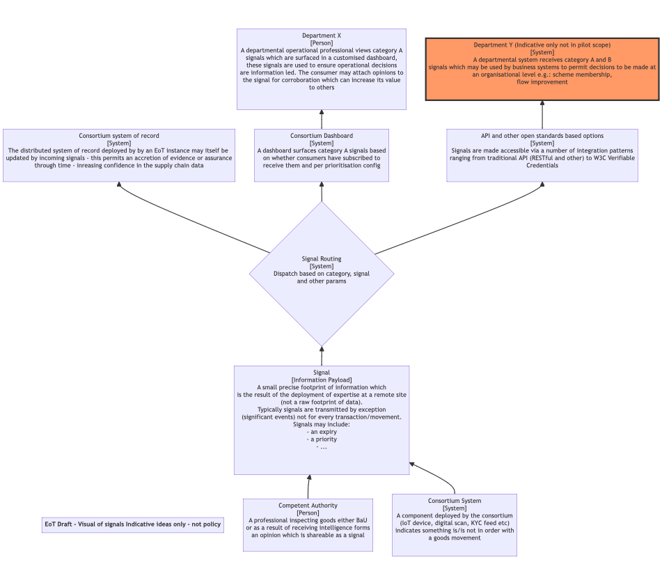

# Signals
[Definitions](#definitions) |
[Use Cases](#use-cases) |
[Interop examples](#other-interop-examples)

TODO:  all the below is up for discussion - please can you help improve it?

## What are Signals?
Signals are simple messages that can be exchanged between organisations to indicate that an action has been taken or that something has been decided or agreeed upon.

With signals insight is moved (the result of deploying expertise over raw data) not the raw data itself. This has many benefits.


**dictionary definitions**

> Noun: 'anything agreed upon or understood as the occasion for concerted action'

> Adjective: 'unusual; notable; outstanding'

> Verb: 'to communicate or make known by a signal'

> 'The fundamental quantity of representing some information'.

## Why Signals? (The problems we are solving)
Signals are an attempt to resolve some of the limitations with the traditional declaration-based mechanism for exchanging information between businesses and government:

*Declarations* 
* Declarations, licence applications notifications etc tend to be large, complex, documents that require complex software to generate and consume.  Changes to the data and associated systems are very disruptive and can take years to complete.
* Declarations are primarily organised for one-way communication (trade to government)
* Deadlines for delivering declarations are based on government needs rather than the business processes that generate the data, making it inconvenient to implement submission solutions.

*Signals*
* Signals are light-weight, with simple payloads and a straightforward version control system. This means it will be less expensive to experiment with new types of information exchange and that signals can be revised, or new signals added, without disrupting existing implementations 
* Signals can be delivered as soon as a corresponding event occurs in the originating business process.  We believe this will allow new workflows to be created based on actual business timings rather than the deadlines set by the government.
* Signals can move in any direction (including from government > trade and trade > trade), creating the potential for feedback loops that are difficult to create with the current declaration processes.

Signals are proposed as a complement to, rather than replacement for, the existing declaration systems. Signals are designed to uplift and transport key events from inside the various systems of record being operated by industry and to capture expertise being deployed over the information inside them. They are not designed or intended to transport the body of supply chain data held in those systems or record.

## Indicative signals diagram


## Use Cases
1.  A supply chain participant conducts some form of due dilligence on a movement of goods and would like to share the outcome with other organisations in the supply chain (including government agencies working at the border)
2.  A trader moving goods under a customs procedure that does not require a pre-lodged customs declaration would like to take advantage of a new (fictional!) scheme being trialled by the government where traders that supply a 10 digit commodity code in advance of goods moving into the country can get an early warning of any checks and inspections that might delay the goods leaving the port.  The commodity
   code must be supplied when the goods leave the port of departure and will be shared with several government departments.
2. The government wants to alert traders about inspection decisions detailing which consignment has been selected and where the inspection will take place.

## What are the features of a well designed signal?
- Signals permit organisations to minimise information share volume while maximising the sharing of expertise
- Signals are typically self contained - they usually do not require additional out of band information to be made available
- Signals reduce the need for complex ontologies and reduce semantics leaking over boundaries due to their more precise/targetted deisgn and footprint
- Signals may be anonymous/opaque - identity of the producer/provider may be omitted
- Signals permit consuming parties to make their own minds up on whether and how to use them for example whether aggregation or corroboration are necessary
- Signals may move bi-directionally between any number of entities participating in a network
- A signal is typically not a large footprint of raw information

## What data should be contained in a signal?
- A signal is typically:
  - An attribute of an event or information element
  - A verified attribute of an event or information element
  - An opinion based on observation of information or events
  - A claim based on analysis of information or events
  - Insight generated by the deployment of expertise over data or events
  - An attestation from an organisation that a signal produced or provided by another organisation is accurate or true

## Which elements and attributes are needed to define a signal?

A non exhaustive starter for ten.

```clojure
{
  :start "2022-03-01T09:00:00.000Z" [1]
  :end "2023-03-31T17:30:00.000Z" [2]
  :priority 5 [3]
  :matching-construct "1c002dd4b5" [4]
  :correlation-id "734713bc04" [5]
  :category "positive-profile" [6]
  :name "Structurally damaged container lorem ipsum" [7]
  :description "The container is caved in - environmental housing destroyed lorem ipsum" [8]
}
```

- 1: An instant from which the signal should be considered valid
- 2: An instant at which the signal should be expired and removed from operational surfaces; dashboards etc
- 3: A priority indicating how important the signal is (various swappable systems for this will be necessary)
- 4: A possibly composite matching construct which relates the signal to information in a consortium EoT instance system
- 5: A unique identifier which lets all actors using and adding to a signal understand they are operating on the same signal (traces through workflows)
- 6: Category used to indicate what kind of signal is being transmitted _or_ if the signal is uplifted from a specific trade or other recognised event
- 7: A simple name to represent the signal where it is placed adjacent to others (human readable and meaningful)
- 8: A more meaningful and full explanation of the signal's purpose (to be disdovered how meaning may be encoded into this)

TODO
* Should we specify a minimum data set, or constrain the data set to a set number of elements in order to prevent documents bloating to the extent they have the same type of problems as traditional declaration exchange mechanisms?

## A protocol implementation (WIP)

- [Border signals protocol](https://github.com/information-sharing-networks/border-signals)

## Other interop examples
other interop implemenations to use or borrow/learn from:

borders
* [DCSA event subscription](https://app.swaggerhub.com/apis/dcsaorg/DCSA_EBL/2.0.0-Beta-2#/Shipping%20Instructions/get_v2_shipping_instructions__shippingInstructionReference_) approach (webhook)  
* NOTN (discussion pending)
* Data Pipelines/waypoints:  [UNCEFACT Data Pipeline White Paper](https://unece.org/fileadmin/DAM/cefact/GuidanceMaterials/WhitePaperDataPipeline_Eng.pdf).  EU sponsored research: [Cassandra](https://cordis.europa.eu/project/id/261795) & [CORE](http://www.coreproject.eu/resources.aspx?filter=6073)

Finance
* FIX - electronic trading  - very simple, pre web, well adopted but possible challenges around multiple dialects
* PSD2 (c.f open banking exchange)  provision of payment services , interesting because (EU) legislation-lead

Industry led examples
* [OpenTravel](https://opentravel.org/) - does not appear to be a web based presence for the spec, but available on request.
* [OpenReferral](https://openreferraluk.org/about-standard) - local council data exchange 
* [GTFS](https://github.com/google/transit/tree/master/gtfs-realtime/spec/en) - public transportation (an example feed - from Connecticut Department of Transportation - is hosted on the [Ably hub](https://ably.com/hub/cttransit/gtfsr)
