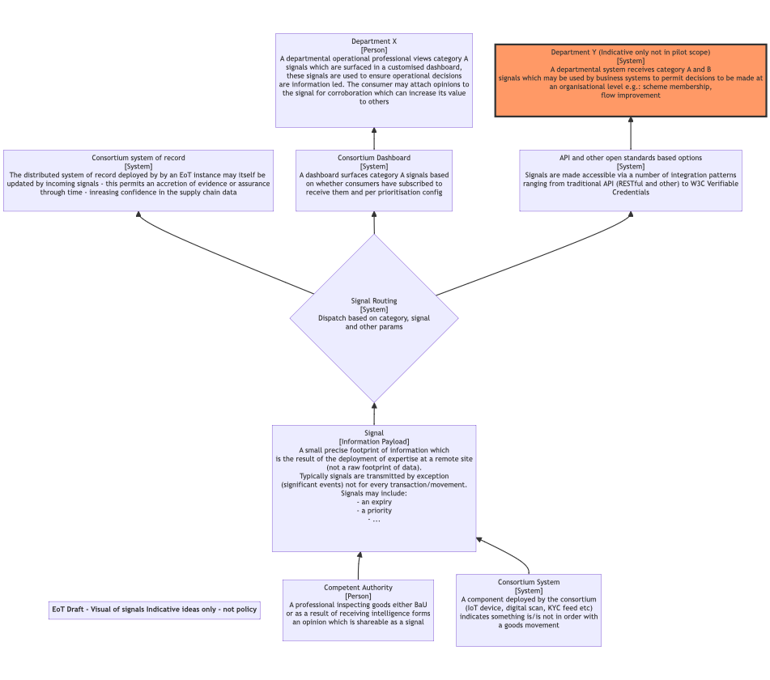

# Specific problems we are solving

## Trade

Within the context of trade signals may resolve some of the limitations with the traditional declaration-based mechanism for exchanging information between businesses and government:

*Declarations*

Declarations, licence applications notifications etc tend to be large, complex, documents that require complex software to generate and consume. Changes to the data and associated systems are very disruptive and can take years to complete.
Declarations are primarily organised for one-way communication (trade to government)
Deadlines for delivering declarations are based on government needs rather than the business processes that generate the data, making it inconvenient to implement submission solutions.

Signals are proposed as a complement to, rather than replacement for, the existing declaration systems. Signals are designed to uplift and transport key events from inside the various systems of record being operated by industry and to capture expertise being deployed over the information inside them. They are not designed or intended to transport the body of supply chain data held in those systems or record.

### Indicative signals diagram

### Use Cases
1.  A supply chain participant conducts some form of due dilligence on a movement of goods and would like to share the outcome with other organisations in the supply chain (including government agencies working at the border)
2.  A trader moving goods under a customs procedure that does not require a pre-lodged customs declaration would like to take advantage of a new (fictional!) scheme being trialled by the government where traders that supply a 10 digit commodity code in advance of goods moving into the country can get an early warning of any checks and inspections that might delay the goods leaving the port.  The commodity
   code must be supplied when the goods leave the port of departure and will be shared with several government departments.
2. The government wants to alert traders about inspection decisions detailing which consignment has been selected and where the inspection will take place.

### A protocol implementation (WIP)

- [Border signals protocol](https://github.com/information-sharing-networks/border-signals)
